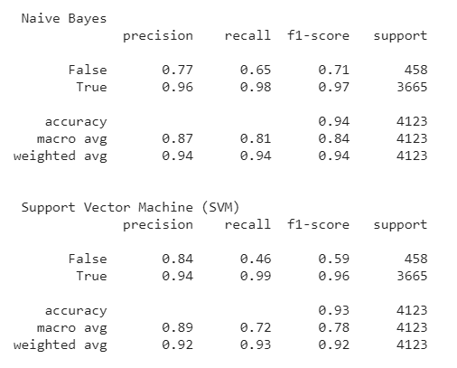
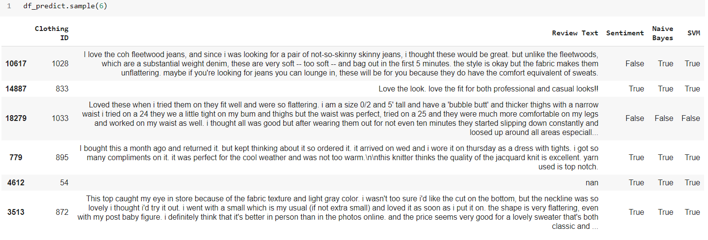

# SENTIMENT ANALYSIS USING SUPERVISED LEARNING 

## About Dataset
**Women's E-Commerce Clothing Reviews on Kaggle**

***Link Dataset***: 

https://www.kaggle.com/nicapotato/womens-ecommerce-clothing-reviews

***Context***

Welcome. This is a Women’s Clothing E-Commerce dataset revolving around the reviews written by customers. Its nine supportive features offer a great environment to parse out the text through its multiple dimensions. Because this is real commercial data, it has been anonymized, and references to the company in the review text and body have been replaced with “retailer”.

***Content***

This dataset includes **23486 rows** and **10 feature variables**. Each row corresponds to a customer review, and includes the variables:
- **Clothing ID**: Integer Categorical variable that refers to the specific piece 
being reviewed.
- **Age**: Positive Integer variable of the reviewers age.
- **Title**: String variable for the title of the review.
- **Review** Text: String variable for the review body.
- **Rating**: Positive Ordinal Integer variable for the product score granted by the customer from 1 Worst, to 5 Best.
- **Recommended** IND: Binary variable stating where the customer recommends the product where 1 is recommended, 0 is not recommended.
- **Positive Feedback Count**: Positive Integer documenting the number of other customers who found this review positive.
- **Division Name**: Categorical name of the product high level division.
- **Department Name**: Categorical name of the product department name.
- **Class Name**: Categorical name of the product class name.

***Acknowledgements***

Anonymous but real source

***Inspiration***

Nicapotato, an owner of dataset Women's E-Commerce Clothing Reviews that looks forward to coming quality NLP! There are also some great opportunities for feature engineering and multivariate analysis.

***Publication***

[Statistical Analysis on E-Commerce Reviews, with Sentiment Classification using Bidirectional Recurrent Neural Network](https://www.researchgate.net/publication/323545316_Statistical_Analysis_on_E-Commerce_Reviews_with_Sentiment_Classification_using_Bidirectional_Recurrent_Neural_Network)

by [Abien Fred Agarap - Github](https://github.com/AFAgarap/ecommerce-reviews-analysis)

## Metadata
**Usage Information**    
- License [CC0: Public Domain](https://creativecommons.org/publicdomain/zero/1.0/)
- Visibility **public**

**Maintainers**
- Dataset owner [nicapotato](https://www.kaggle.com/nicapotato)

**Updates**

    Expected update frequency (Not specified)
    Last updated 2018-02-04
    Date created 2018-02-04      
    Current version Version 1

## Objectives

**Problem Framing**
* How to predict sentiment analysis from Women's E-Commerce Clothing Reviews?

**Ideal Outcome**
* A success metric is that a sentence can be classified as positive, negative, or neutral as predicted by the model. 
* Success means predicting >90% for sentiment analysis. 
* Failure means the number of accuracy sentiment predicted is no better than current heuristics.

**Heuristics**
* Consider reviews of people who buy products in the past. Assume that new items buyers by these people will also become positive, negative, or neutral critics.

**Formulation of the problem**
* The algorithm used for Supervised learning is the Naive Bayes Model and Support Vector Machine (SVM).  

## References

**Supervised Leaning**

Supervised learning, also known as supervised machine learning, is a subcategory of machine learning and artificial intelligence. It defines by its use of labeled datasets to train algorithms to classify data or predict outcomes accurately. When input data is entering into the model, the weights are adjusted through the reinforcement learning process, ensuring that the model is installing correctly. Supervised learning helps organizations solve real-world problems at scale, such as classifying spam in separate folders from your inbox.

Various algorithms and computation techniques use in supervised machine learning processes. Below are brief explanations of some of the most commonly used learning methods, typically calculated through the use of programs like R or Python:

- **Naive Bayes**

Naive Bayes is a classification approach that adopts the principle of class conditional independence from the Bayes Theorem. That means the presence of one feature does not impact another represent in the probability of a given outcome, and each predictor has an equal effect on that result. There are three types of Naïve Bayes classifiers: Multinomial Naïve Bayes, Bernoulli Naïve Bayes, and Gaussian Naïve Bayes. This technique is primarily using in-text classification, spam identification, and recommendation systems.

- **Support Vector Machine (SVM)**

A support vector machine is a supervised learning model used for both data classification and regression. That said, it is typically leveraged for classification problems, constructing a hyperplane where the distance between two classes of data points is at its maximum. This hyperplane is known as the decision boundary, separating the many data points (e.g., oranges vs. apples) on either side of the plane.

Sources
- [An Ultimate Guide to Understanding Supervised Learning](https://www.digitalvidya.com/blog/supervised-learning/)
- [Machine Learning Crash Course](https://developers.google.com/machine-learning/crash-course)
- [Predicting Sentiment from Clothing Reviews](https://www.kaggle.com/burhanykiyakoglu/predicting-sentiment-from-clothing-reviews)
- [Supervised Learning](https://www.ibm.com/cloud/learn/supervised-learning)

## Methode
**Data Preparation for Models**

* Import Libraries
* Select Data for Sentiment Analyst
* CountVectorizer() converts a collection of text documents to a matrix of token counts. Then assign a shorter name for the analysis to tokenize the string data.
* For wordcounts function
    
        - tokenize the string and continue, if it is not empty
        - find counts of the vocabularies and transform them into the array
        - define vocab and index (index of w)
        - items () changes dictionary (word, index) tuple pairs

**Modeling Data Using Supervised Learning Model**

* Add a new column to the data frame for review clean.
* Define Rating Categorical

        Rating of 4 or higher -> positive, while the ones with
        Rating of 2 or lower -> negative
        Rating of 3 -> neutral

* Split data, select the columns, and prepare data for the models.
* Find code for missing values.
* Define a data frame for the predictions
* Preparation for the confusion matrix
* See Precision-Recall - F1-Score 
* See the prediction

## Results

Precision-Recall - F1-Score 

    - Success metric predicting >90% for sentiment analysis using Naïve Bayes & SVM Model for Supervised Learning.
    - Naïve Bayes Model is the most recommended model training for Women’s E-Commerce Clothing Reviews Dataset based on our experiment. 

The confusion matrix

    - True Positives (TP) - These are the correctly predicted positive values which means that the value of actual class is yes and the value of predicted class is also yes. 
    - True Negatives (TN) - These are the correctly predicted negative values which means that the value of actual class is no and value of predicted class is also no.
    
    False positives and false negatives, these values occur when your actual class contradicts with the predicted class.
    - False Positives (FP) – When actual class is no and predicted class is yes.
    - False Negatives (FN) – When actual class is yes but predicted class in no. 

Dataframe for the predictions using code that define before

    - That can see from the statement is False. The result for Naive Bayes and SVM models are True. That can be called False Positives (FP).
